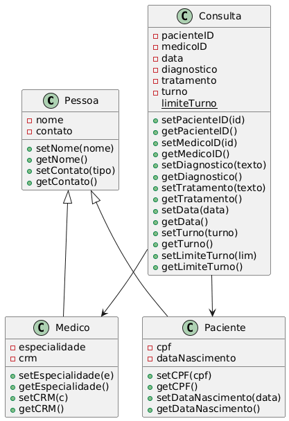

🏥 Sistema de Clínica Médica
--
- Sistema web para gestão de clínica médica, focado na usabilidade, organização e agilidade no atendimento.
Permite cadastrar pacientes, médicos e gerenciar consultas com filtros dinâmicos e interface moderna.

---

🚀 Tecnologias Utilizadas
O projeto foi desenvolvido combinando performance e design moderno:
- React.js: Construção da interface reativa e componentizada
- Ant Design (AntD): Layout profissional, tabelas e componentes visuais
- JavaScript (ES6+): Lógica de manipulação de dados e estados

---

⚙ Funcionalidades do Sistema
O sistema é dividido em três módulos principais, acessíveis pela barra de navegação superior:
1. 🧑 Pacientes
Cadastro e manutenção da base de clientes da clínica.
- Dados: Nome completo, CPF e Data de Nascimento
- Visualização: Listagem organizada com ações rápidas
2. 👨‍⚕ Médicos
Gestão do corpo clínico e especialidades.
- Dados: Nome completo, Especialidade e CRM
- Visualização: Lista com ações de edição e exclusão
3. 🩺 Consultas
Módulo central para agendamento e histórico de atendimentos.
- Grid Interativo: Tabela relacionando Paciente × Médico × Data
- Filtro Inteligente: Campo “Filtrar por data”
- Feedback Visual: Indicação quando não há registros
- Gestão: Botão de atualização e ações rápidas

---

📐 Diagrama UML do Sistema
Abaixo está o diagrama UML representando a estrutura das entidades do sistema:

---

💡 Roteiro de Teste Recomendado
Como o sistema utiliza armazenamento temporário no navegador (sem banco de dados persistente), recomenda-se seguir este fluxo:
- Cadastre ao menos um Médico
- Cadastre ao menos um Paciente
- Vá até Consultas e agende uma consulta
- Utilize o filtro por data para testar a busca
- Explore as ações de edição, visualização e exclusão

---

💻 Como Rodar (StackBlitz)
Este projeto está hospedado no StackBlitz, permitindo execução imediata:
- Acesse o link do projeto
- Aguarde a instalação automática das dependências
- O sistema abrirá no painel de preview
✅ Execução local (VS Code)
npm install
npm start

---
