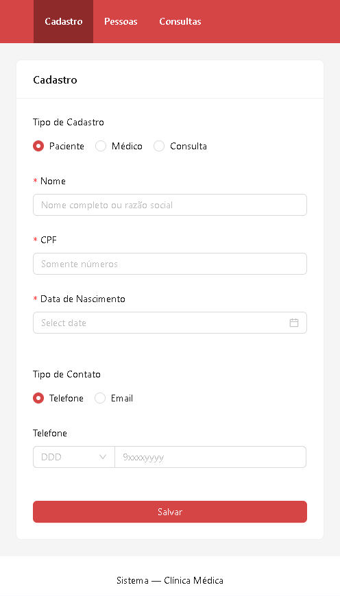
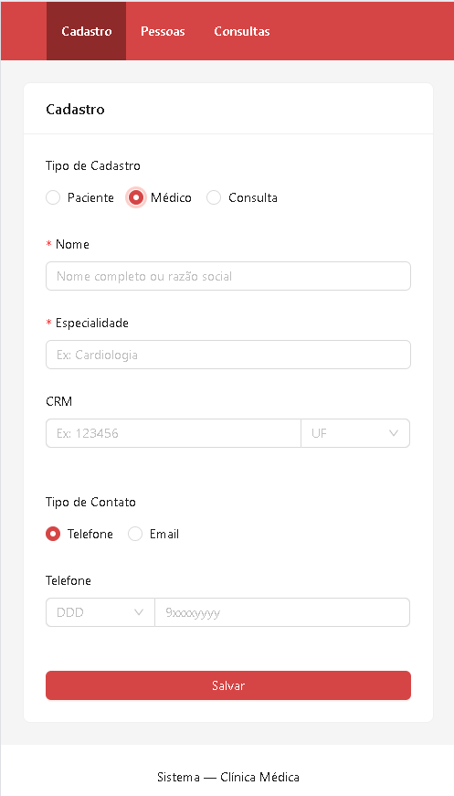
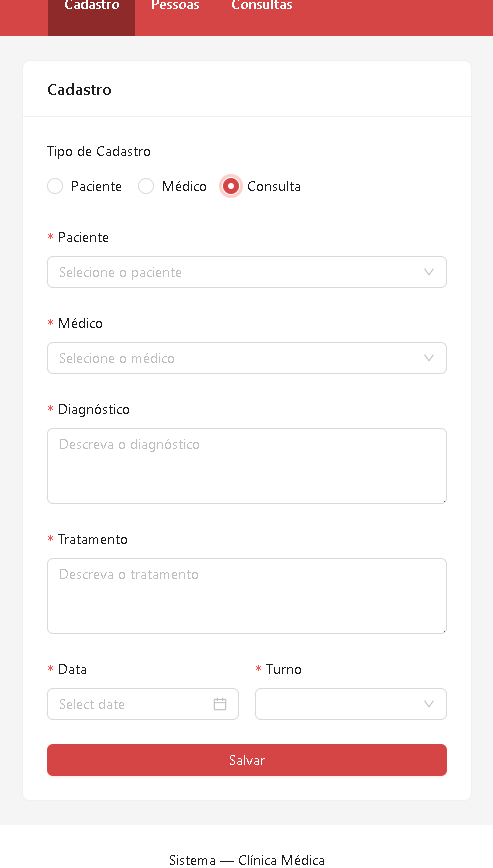
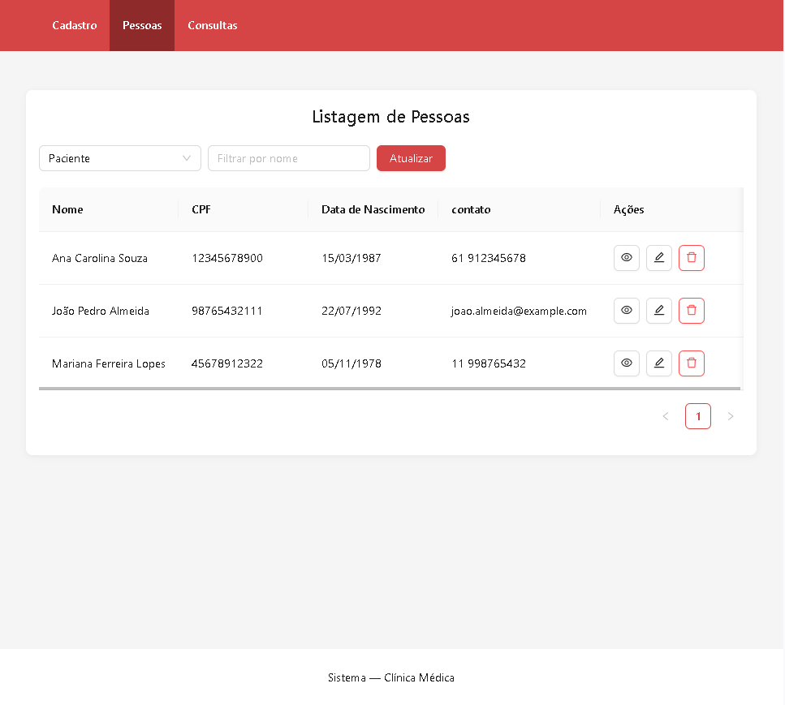
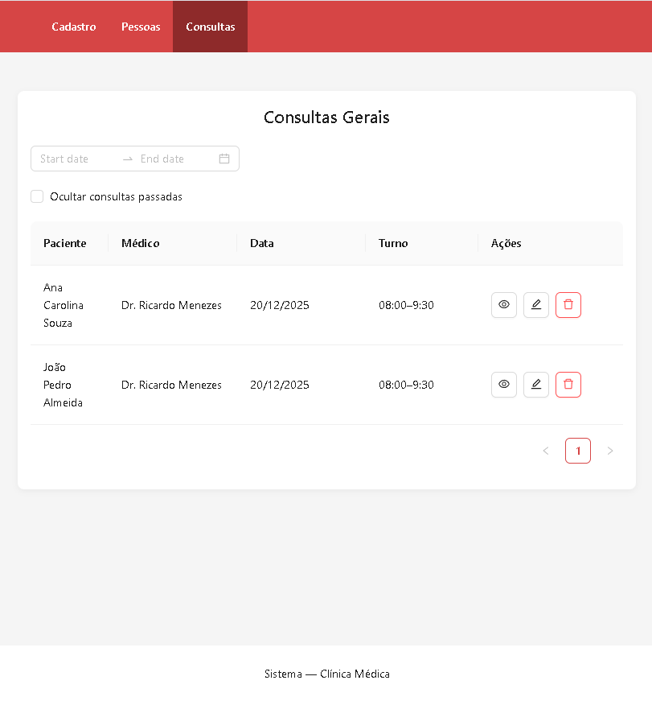
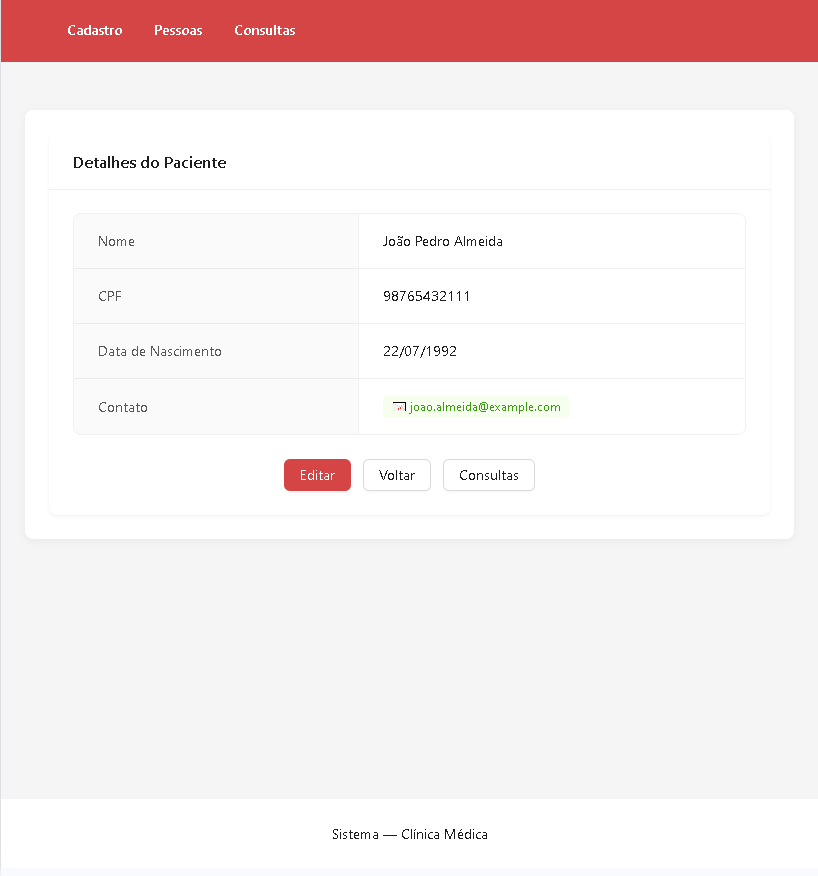
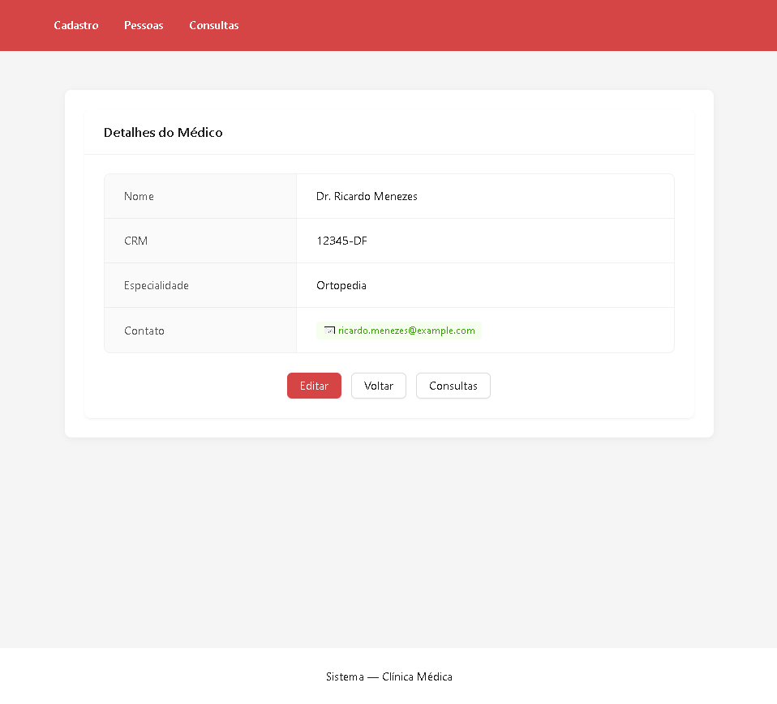
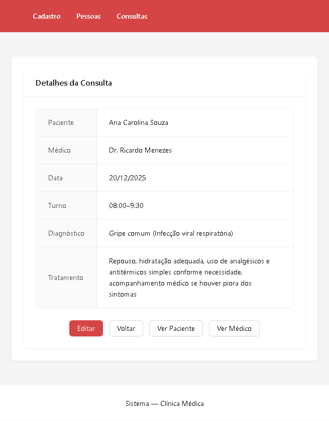

🏥 Sistema de Clínica Médica
--
- Sistema web para gestão de clínica médica, focado na usabilidade, organização e agilidade no atendimento.
Permite cadastrar pacientes, médicos e gerenciar consultas com filtros dinâmicos e interface moderna.

---

🌐 Deploy da Aplicação

🔗 https://sistemadeclinicamedica-zia4--5173--365214aa.local-credentialless.webcontainer.io/
🔗 https://stackblitz.com/~/github.com/RaphaelScheideggerG/Sistema-de-Clinica-Medica

---

🧭 Visão Geral do Projeto

Domínio: Gestão de Clínica Médica
Entidades principais: Cadastro de Paciente, Médico, Consultas.
Objetivo: Sistema web para gestão de clínica médica, focado na usabilidade, organização e agilidade no atendimento.
Permite cadastrar pacientes, médicos e gerenciar consultas com filtros dinâmicos e interface moderna.
Persistência: Realizada via LocalStorage (Web Storage API).

---

🧰 Tecnologias Utilizadas

- React.js: Construção da interface reativa e componentizada
- Ant Design (AntD): Layout profissional, tabelas e componentes visuais
- JavaScript (ES6+): Lógica de manipulação de dados e estados

---

🎯 Desafio Atendido (CRUDs + Relacionamentos)
O projeto atende integralmente ao desafio proposto, contemplando:

✅ CRUD de Paciente
✅ CRUD de Médico
✅ Relacionamentos entre Paciente, Médico com a Consulta
✅ Uso de Web Storage API para persistência

---

📋 Requisitos Funcionais (RF)

Paciente
RF01 — Cadastrar Paciente
RF02 — Listar Pacientes
RF03 — Visualizar detalhes do Paciente
RF04 — Editar Paciente
RF05 — Remover Paciente
RF06 —  Nome, CPF, Email ou Telefone, Data de Nascimento
Médico
RF07 — Cadastrar Médico
RF08 — Listar Médico
RF09 — Editar Médico
RF10 — Remover Médico
RF11 — Associar Nome, CRM, Especialidade, Email ou Telefone.
Consulta
RF12 — Cadastrar Consulta
RF13 — Listar Consultas
RF14 — Editar Consultas
RF15 — Remover Consultas
RF16 — Associar Paciente, Médico, Diagnóstico, Tratamento, Data, Turno
RF17 - Limitar a quantidade de consultar no mesmo dia e turno do médico
⚙️ Requisitos Não Funcionais (RNF)
RNF01 — Aplicação desenvolvida em ReactJS
RNF02 — Interface construída com Ant Design
RNF03 — Uso do padrão DAO para acesso aos dados
RNF04 — Interface responsiva
RNF05 — Validação de formulários
RNF06 — Código organizado por componentes e responsabilidades

---

🖼️ Telas da Aplicação
As telas abaixo ilustram as principais funcionalidades do sistema.

## Tela 1 Cadastro

## Tela 2 Lista pessoas

## Tela 3 Lista Consultas

## Tela 4 Visualiza Pessoas

## Tela 5 Visualiza Consulta

---

🧠 Modelagem dos Dados
📌 Diagrama de Classes
O diagrama de classes abaixo representa o modelo conceitual utilizado no projeto, servindo como base para o Backend e para o consumo no FrontEnd.

O diagrama foi modelado utilizando PlantUML, conforme o arquivo uml6.txt.

---

📂 Estrutura do Projeto FrontEnd

---

▶️ Execução Local

npm install
npm run dev

---

👥 Autoria
Autores: Ana Carolina Moraes Belo, Matheus Teixeira de Oliveira, Raphael Scheidegger Guedes
Projeto: Bolsa Futuro Digital (BFD)
Área: Desenvolvimento FrontEnd
Instituição: Instituto Federal de Brasília (IFB)

---

📌 Considerações Finais
Este projeto demonstra:
- domínio dos conceitos de CRUD;
- aplicação de modelagem UML;
- aplicação publicada em ambiente de produção.
