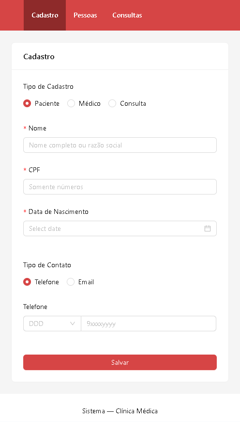
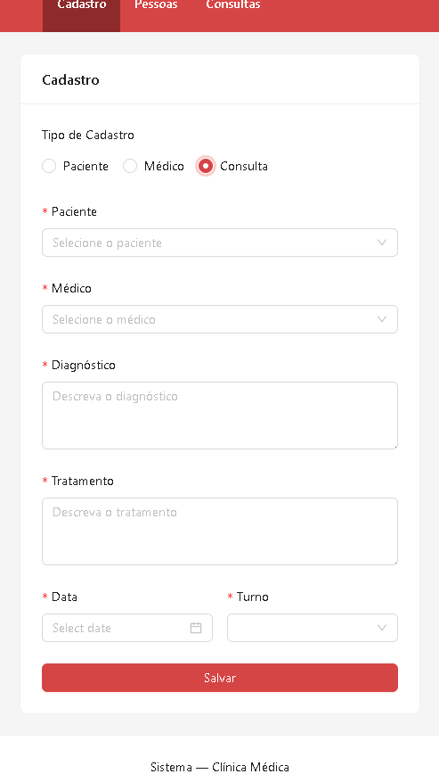
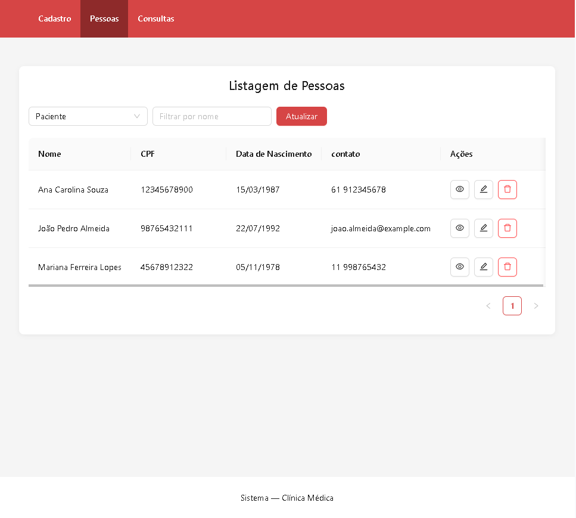
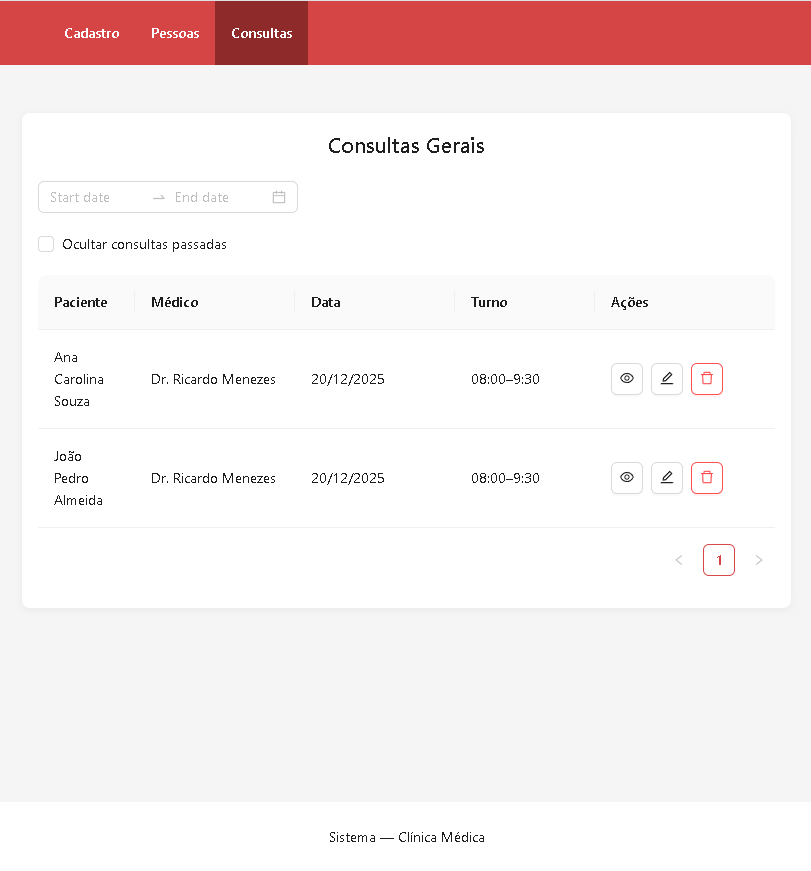
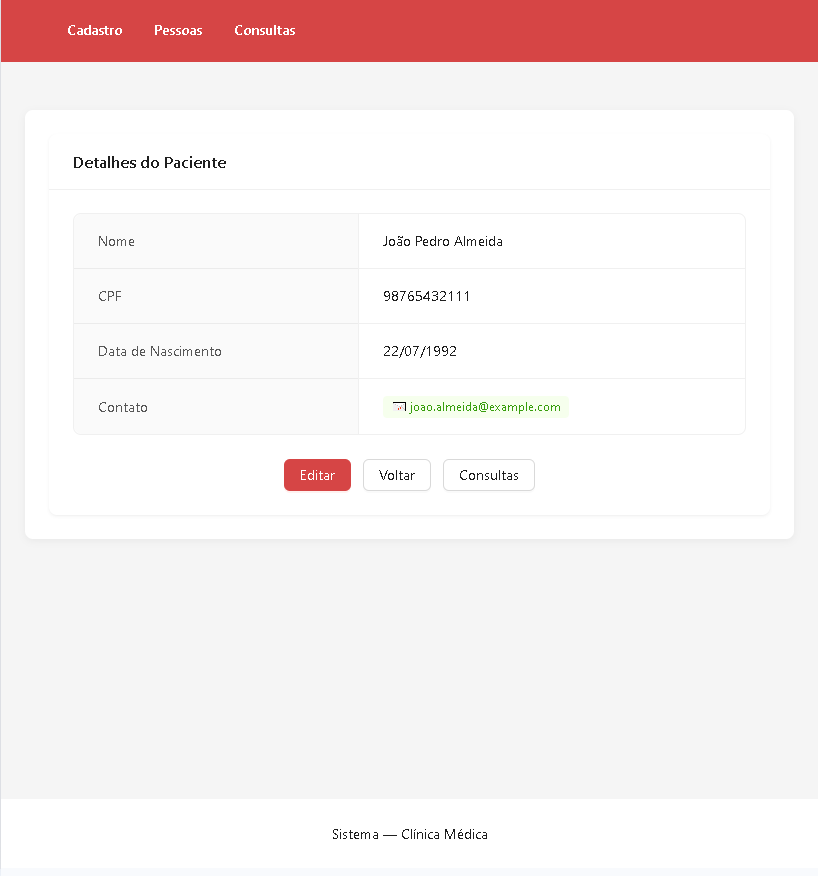
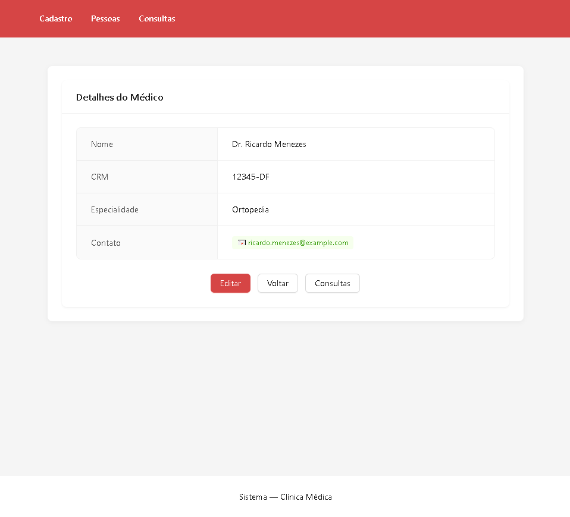
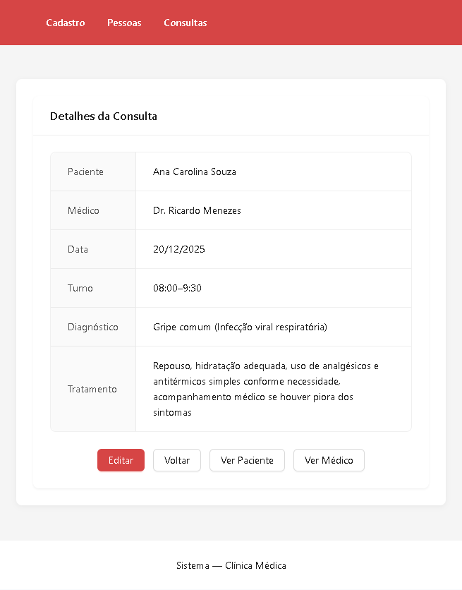
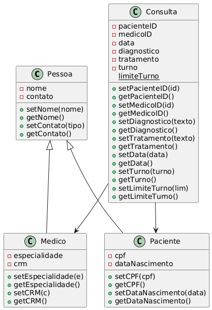

# 🏥 Sistema de Clínica Médica

Sistema web para gestão de clínica médica, desenvolvido com foco em **usabilidade, organização e agilidade no atendimento**.

A aplicação permite cadastrar pacientes e médicos, gerenciar consultas e consultar os registros por meio de uma interface moderna e responsiva.

---

## 🌐 Deploy da aplicação

🔗 [Acessar a aplicação](https://sistema-de-clinica-medica.vercel.app)

🔗 [Abrir o projeto no StackBlitz](https://stackblitz.com/~/github.com/RaphaelScheideggerG/Sistema-de-Clinica-Medica)

---

## 🧭 Visão geral do projeto

**Domínio:** Gestão de Clínica Médica

**Entidades principais:**
- Paciente
- Médico
- Consulta

**Objetivo:** oferecer uma aplicação web para cadastro e gerenciamento de pacientes, médicos e consultas, com filtros, validações e interface organizada.

**Persistência:** realizada por meio do `LocalStorage`, utilizando a Web Storage API.

---

## 🧰 Tecnologias utilizadas

- **React.js** — construção da interface reativa e componentizada.
- **Ant Design (AntD)** — componentes visuais, tabelas, formulários e estrutura da interface.
- **JavaScript (ES6+)** — lógica da aplicação, manipulação de dados e gerenciamento de estados.
- **LocalStorage / Web Storage API** — persistência dos dados no navegador.
- **PlantUML** — modelagem e documentação do diagrama de classes.

---

## 🎯 Desafio atendido

O projeto atende ao desafio proposto contemplando:

- ✅ CRUD de Pacientes
- ✅ CRUD de Médicos
- ✅ CRUD de Consultas
- ✅ Relacionamentos entre Pacientes, Médicos e Consultas
- ✅ Persistência utilizando a Web Storage API
- ✅ Validação de formulários
- ✅ Interface responsiva
- ✅ Organização do acesso aos dados utilizando o padrão DAO

---

## 📋 Requisitos funcionais

### Paciente

- **RF01** — Cadastrar paciente
- **RF02** — Listar pacientes
- **RF03** — Visualizar detalhes do paciente
- **RF04** — Editar paciente
- **RF05** — Remover paciente
- **RF06** — Armazenar nome, CPF, e-mail, telefone e data de nascimento

### Médico

- **RF07** — Cadastrar médico
- **RF08** — Listar médicos
- **RF09** — Editar médico
- **RF10** — Remover médico
- **RF11** — Armazenar nome, CRM, especialidade, e-mail e telefone

### Consulta

- **RF12** — Cadastrar consulta
- **RF13** — Listar consultas
- **RF14** — Editar consultas
- **RF15** — Remover consultas
- **RF16** — Associar paciente, médico, diagnóstico, tratamento, data e turno
- **RF17** — Limitar a quantidade de consultas do mesmo médico no mesmo dia e turno

---

## ⚙️ Requisitos não funcionais

- **RNF01** — Aplicação desenvolvida em React.js
- **RNF02** — Interface construída com Ant Design
- **RNF03** — Uso do padrão DAO para acesso aos dados
- **RNF04** — Interface responsiva
- **RNF05** — Validação de formulários
- **RNF06** — Código organizado por componentes e responsabilidades

---

## 🖼️ Telas da aplicação

As imagens abaixo apresentam as principais funcionalidades e fluxos da aplicação.

### Cadastro






### Lista de pessoas



### Lista de consultas



### Visualização de pacientes e médicos





### Visualização de consulta



---

## 🧩 Modelagem e orientação a objetos

O sistema utiliza conceitos de **orientação a objetos** para representar as entidades do domínio e suas responsabilidades.

A modelagem é documentada por meio de um **diagrama de classes UML**, desenvolvido com PlantUML.

### Relacionamentos

O modelo representa explicitamente os relacionamentos entre:

- **Paciente**
- **Médico**
- **Consulta**

A entidade **Consulta** relaciona um paciente a um médico e concentra os dados específicos do atendimento, como diagnóstico, tratamento, data e turno.

Esses relacionamentos permitem representar no modelo as regras do domínio relacionadas ao agendamento e ao vínculo entre as entidades.

### Encapsulamento

O diagrama UML também documenta o **encapsulamento das classes**, representando seus atributos e operações como parte das responsabilidades de cada entidade.

A separação entre dados e operações ajuda a manter cada classe responsável pelo próprio estado e comportamento, enquanto os relacionamentos entre as classes representam as associações necessárias ao domínio.

### Diagrama de classes



O diagrama foi modelado utilizando **PlantUML** e serve como documentação da estrutura conceitual utilizada no projeto.

---

## ▶️ Execução local

Instale as dependências:

```bash
npm install
```

Execute a aplicação em modo de desenvolvimento:

```bash
npm run dev
```

---

## 👥 Autoria

**Autores:**
- Ana Carolina Moraes Belo
- Matheus Teixeira de Oliveira
- Raphael Scheidegger Guedes

**Projeto:** Bolsa Futuro Digital (BFD)

**Área:** Desenvolvimento FrontEnd

**Instituição:** Instituto Federal de Brasília (IFB)

---

## 📌 Considerações finais

Este projeto demonstra a aplicação prática de:

- conceitos de CRUD;
- relacionamentos entre entidades;
- orientação a objetos;
- encapsulamento;
- modelagem UML;
- padrão DAO;
- persistência com `LocalStorage`;
- componentização em React;
- validação de formulários;
- desenvolvimento de interface responsiva.

A aplicação também foi publicada em ambiente de execução web, permitindo demonstrar o sistema de forma prática.
